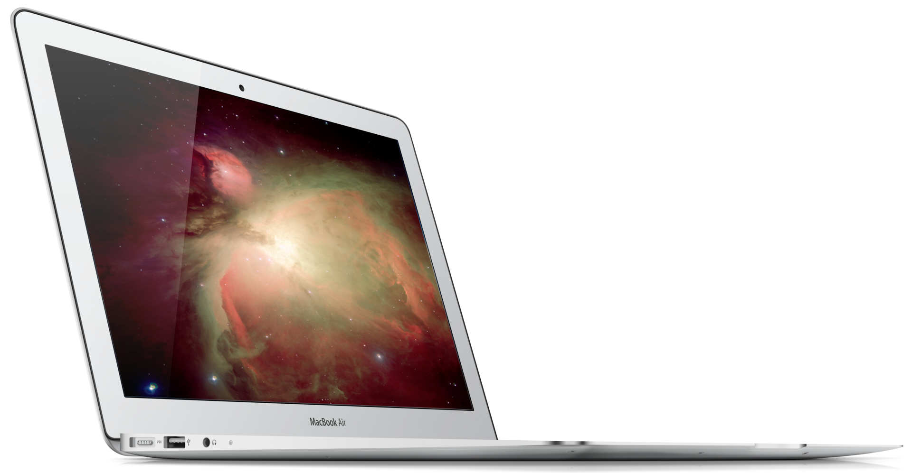

# What To Do with a Stolen Laptop

Andrew Temme

---

How I came to own a stolen laptop,
its troubles, and the technical exploration of a MacBook Air's input system.

---

## Objectives

- Appreciate SPI buses
- Improve understanding of Apple design
- Troubleshoot hardware

---

## Stolen Goods

---

## HW or SW

Notes:

GPS that we thouht was sw for sure

---

1. Read
2. Find Possible Causes
3. Rank by Impact
4. Backup
5. Attempt to Fix
 
 ---

 